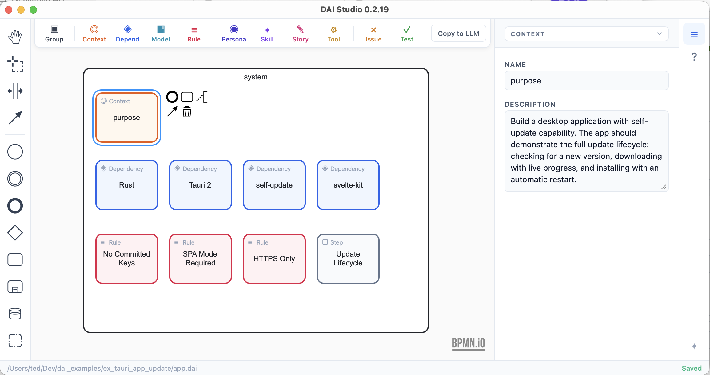

# ex_tauri_app_update — Tauri 2 Self-Update Demo

[](https://dai.studio)

A minimal desktop application demonstrating Tauri 2's self-update plugin with a SvelteKit frontend — designed in DAI Studio.

## Designed with DAI Studio



This project was designed in [DAI Studio](https://dai.studio) before a single line of code was written. The `app.dai` file at the root of this repo is the workflow. Open it in DAI Studio to explore or remix the design.

> See [`session.md`](session.md) for the complete AI session that built this project.

### What's in the diagram

| Type | Name | Description |
|------|------|-------------|
| Context | Purpose | Build a desktop application with self-update capability |
| Dependency | Rust | Systems language powering the Tauri backend — native OS integration, IPC commands, update logic |
| Dependency | Tauri 2 | Desktop shell — native window, file system, IPC |
| Dependency | SvelteKit | SPA-mode frontend (adapter-static, ssr=false required) |
| Dependency | self-update | tauri-plugin-updater v2 — update check, download, install via HTTPS |
| Rule | No Committed Keys | The private signing key must never be committed to version control |
| Rule | SPA Mode Required | SvelteKit must use adapter-static with ssr=false — Tauri has no Node.js server |
| Rule | HTTPS Only | Update endpoints must be served over HTTPS in production |
| Step | Update Lifecycle | Check → download with progress streaming → verify signature → install → restart |

---

The app provides a clean reference implementation of the full update lifecycle: checking for updates, downloading with live progress, and installing with an automatic restart.

## Tech Stack

| Layer | Technology |
|-------|-----------|
| Desktop shell | [Tauri 2](https://tauri.app) |
| Frontend | [SvelteKit 2](https://kit.svelte.dev) + [Svelte 5](https://svelte.dev) (SPA mode) |
| Language | TypeScript (frontend), Rust (backend) |
| Build tool | Vite 6 |
| Self-update | `tauri-plugin-updater` v2 |

## Prerequisites

Before you start, install the following:

1. **Rust** — via [rustup](https://rustup.rs)
2. **Node.js** — v18 or later (LTS recommended)
3. **Tauri system dependencies** for your platform:
   - **macOS** — Xcode Command Line Tools (`xcode-select --install`)
   - **Linux** — WebKit2GTK and other libraries; see the [Tauri Linux prerequisites guide](https://tauri.app/start/prerequisites/#linux)
   - **Windows** — Microsoft Visual Studio C++ Build Tools and WebView2; see the [Tauri Windows prerequisites guide](https://tauri.app/start/prerequisites/#windows)

## Setup

### 1. Clone and install JS dependencies

```bash
git clone <repo-url>
cd tauri_app_self_update
npm install
```

Rust dependencies are resolved automatically by Cargo during the first build — no separate step needed.

### 2. Generate a signing key pair

Tauri requires a minisign key pair to sign update artifacts and verify them on the client. Generate one with:

```bash
npm run tauri signer generate -- -w ~/.tauri/blank.key
```

This creates two files:
- `~/.tauri/blank.key` — **private key** (keep this secret, never commit it)
- `~/.tauri/blank.key.pub` — public key

Copy the contents of `~/.tauri/blank.key.pub` into the `plugins.updater.pubkey` field in `src-tauri/tauri.conf.json`:

```json
"plugins": {
  "updater": {
    "pubkey": "<paste your public key here>",
    ...
  }
}
```

> **Important:** The private key at `~/.tauri/blank.key` must never be committed to version control. If it is lost, you will be unable to release future updates to existing installations.

## Development

No signing key is required for development.

```bash
# Recommended
make dev

# Alternatives
./run.sh dev
npm run tauri dev
```

Tauri will start the Vite dev server on port 1420 and open the app window. The frontend supports hot-module replacement.

## Production Build

The build requires your private signing key. The `Makefile` and `run.sh` automatically load it from `~/.tauri/blank.key` if the `TAURI_SIGNING_PRIVATE_KEY` environment variable is not already set.

```bash
# Recommended (auto-loads the key)
make build

# Alternative
./run.sh build

# Manual (set the key yourself first)
export TAURI_SIGNING_PRIVATE_KEY="$(cat ~/.tauri/blank.key)"
export TAURI_SIGNING_PRIVATE_KEY_PASSWORD=""
npm run tauri build
```

Build output is placed in `src-tauri/target/release/bundle/`. Each platform produces:
- A native installer/bundle (`.app` on macOS, `.AppImage` / `.deb` on Linux, `.msi` / `.exe` on Windows)
- A `.tar.gz` archive of the bundle
- A `.sig` signature file — required for the update server manifest

## Self-Update Server Setup

The app polls an HTTPS endpoint at runtime to check for updates. You must host this endpoint yourself.

### 1. Update the endpoint URL

Open `src-tauri/tauri.conf.json` and replace the placeholder URL with your actual server:

```json
"plugins": {
  "updater": {
    "endpoints": [
      "https://your-server.example.com/blank/{{target}}/{{arch}}/latest.json"
    ]
  }
}
```

> **Note:** The current value (`releases.example.com`) is a placeholder. The app will not be able to check for updates until this is replaced with a real HTTPS URL.

The `{{target}}` and `{{arch}}` placeholders are substituted at runtime:
- `{{target}}` — `darwin`, `linux`, or `windows`
- `{{arch}}` — `aarch64` or `x86_64`

### 2. Build and host the update artifacts

After running `make build`, upload the generated bundles and `.tar.gz` files to your server.

### 3. Create the update manifest

Use `latest.json.template` as a guide to create a `latest.json` file for each target/arch combination:

```json
{
  "version": "0.2.0",
  "pub_date": "2026-03-25T00:00:00Z",
  "notes": "What's new in this release",
  "platforms": {
    "darwin-aarch64": {
      "signature": "<contents of the .sig file>",
      "url": "https://your-server.example.com/blank/darwin/aarch64/blank.app.tar.gz"
    },
    "darwin-x86_64": { "signature": "...", "url": "..." },
    "linux-x86_64":  { "signature": "...", "url": "..." },
    "windows-x86_64": { "signature": "...", "url": "..." }
  }
}
```

The `signature` field is the raw text content of the corresponding `.sig` file. Tauri verifies this cryptographically before installing any update.

Serve each `latest.json` at the endpoint URL matching its target and architecture.

## How the Self-Update Feature Works

The update flow is split across three layers:

### Tauri configuration (`src-tauri/tauri.conf.json`)
- `bundle.createUpdaterArtifacts: true` — instructs `tauri build` to generate `.tar.gz` + `.sig` artifacts
- `plugins.updater.pubkey` — the public key embedded in the binary for signature verification
- `plugins.updater.endpoints` — the HTTPS URL the app polls to check for a newer version

### Rust backend (`src-tauri/src/lib.rs`)
- `check_update` command — calls the updater plugin to fetch the endpoint and compare versions. If an update is available, stores the pending `Update` object in a `Mutex` and returns metadata (new version, current version, release notes) to the frontend.
- `apply_update` command — retrieves the stored `Update`, downloads the artifact, and streams `DownloadEvent` progress events (`Started`, `Progress`, `Finished`) back to the frontend via a Tauri IPC `Channel`. After installation completes, calls `app.restart()`.

### SvelteKit frontend (`src/routes/+page.svelte`)
- Manages a discriminated-union `Status` state (`idle` → `checking` → `available` / `up-to-date` → `downloading` → `installing`).
- Renders a check button, live download progress bar, release notes, and an install button.
- Calls the Rust commands via `@tauri-apps/api` invoke and streams progress updates through an IPC channel.

## Environment Variables

| Variable | Required | Description |
|----------|----------|-------------|
| `TAURI_SIGNING_PRIVATE_KEY` | Required for builds | Raw text content of the private key file. `Makefile`/`run.sh` auto-load from `~/.tauri/blank.key` if unset. |
| `TAURI_SIGNING_PRIVATE_KEY_PASSWORD` | Optional | Password for the private key. Defaults to empty (key generated without a password). |
| `SDKROOT` | macOS only | Set automatically by `Makefile`/`run.sh` via `xcrun --show-sdk-path`. |

> Tauri does not support loading signing keys from `.env` files. These must be real environment variables set in the shell.

## Project Structure

```
tauri_app_self_update/
├── src/                          # SvelteKit frontend
│   ├── app.html                  # HTML shell
│   └── routes/
│       ├── +layout.ts            # Disables SSR (SPA mode)
│       └── +page.svelte          # Update UI (check, download, install)
│
├── src-tauri/                    # Tauri / Rust backend
│   ├── Cargo.toml                # Rust package manifest
│   ├── build.rs                  # Calls tauri_build::build()
│   ├── tauri.conf.json           # App config, bundle settings, updater config
│   ├── src/
│   │   ├── main.rs               # Binary entry point
│   │   └── lib.rs                # Plugin setup, check_update / apply_update commands
│   └── capabilities/
│       └── default.json          # IPC capability grants (includes updater:default)
│
├── app.dai                       # DAI Studio workflow diagram
├── latest.json.template          # Template for the update server manifest
├── session.md                    # The AI session that built this project
├── Makefile                      # dev, build, check targets (handles key loading)
├── run.sh                        # Shell script equivalent of Makefile targets
├── package.json                  # JS dependencies and scripts
├── svelte.config.js              # SvelteKit config (static adapter)
└── vite.config.js                # Vite config (port 1420)
```

## Recommended IDE Setup

[VS Code](https://code.visualstudio.com/) with the following extensions:
- [Svelte for VS Code](https://marketplace.visualstudio.com/items?itemName=svelte.svelte-vscode)
- [Tauri](https://marketplace.visualstudio.com/items?itemName=tauri-apps.tauri-vscode)
- [rust-analyzer](https://marketplace.visualstudio.com/items?itemName=rust-lang.rust-analyzer)
